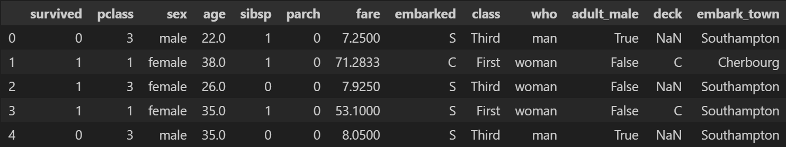
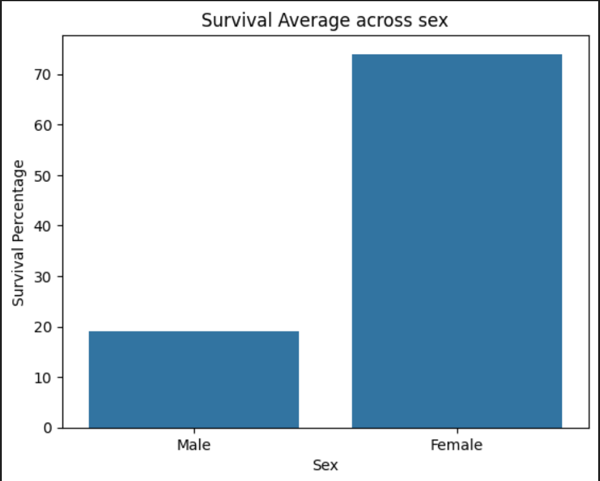
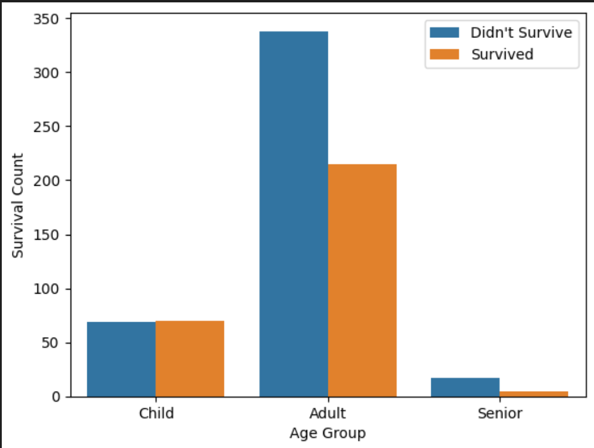
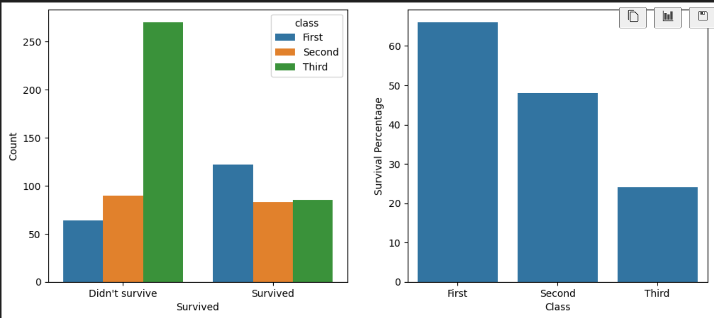
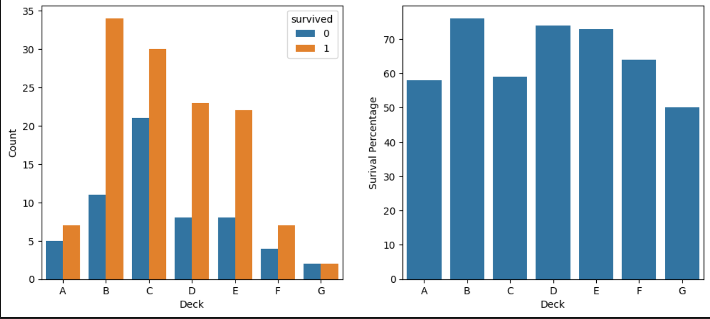

# Titanic Analysis

### Contents
 - [Overview](#overview)
 - [Tools Used](#tools-used)
 - [Dataset](#dataset)
 - [Analysis](#analysis-performed)
 - [Key Skills](#key-skills-demonstrated)
 - [How to Run](#how-to-run)
 - [Conclusion](#conclusion)

## Overview
This project explores the Titanic dataset using Python, Pandas, Seaborn, and Matplotlib. The aim is to identify key patterns in passenger survival by examining factors such as sex, class, and age.

## Tools Used
- Python
- Pandas
- Seaborn
- Matplotlib
- Jupyter Notebook

## Dataset
The dataset was loaded directly from Seaborn using:

```python
sns.load_dataset("titanic")
```

It includes passenger information such as:
 - survival status
 - sex
 - age
 - passenger class
 - deck
 - fare
 - whether the passenger was alone

## Analysis Performed
### 1. Initial data inspection
First I loaded the dataset and inspected the columns and rows to see what data can be extracted. I also made sure to look at the null values that are contained in the dataset to ensure no incorrect correlations are found.



### 2. Survival by Sex
A count plot was used to compare survival counts for male and female passengers.



**finding** 
It was clear that females had a much higher survival rate than males

### 3. Survival by Age Group
The passengers were then split into age groups, seeing that most passengers are middle aged. Through analysis of this dataset, it was clear to see that younger passengers were much more likely to survive, with children having the highest survival rate and seniors having the lowest survival rate.



**finding**
survival rate 
children > adults > seniors

### 4. Survival by Passenger Class
A barplot was used to find the survival rate across passenger class. It was clear to see that higher class passengers were priority, with there being more urgency placed on saving the female passengers, even in first class. 



### 5. Survival by passenger deck
A lot of rows needed to be dropped in order to analyse the passenger deck data. Due to this, it wasn't clear if there was a significant correlation between passenger deck and their survival rate. 



## Key Skills Demonstrated
- Loading and inspecting datasets
- Cleaning data by removing missing values
- Using `groupby()` and `mean()` for aggregation
- Creating clear visualisations with Seaborn
- Drawing conclusions from real data

## How to Run
1. Create a virtual environment and activate it
2. install the requirements with `pip install -r requirements.txt`
2. Open the notebook in Jupyter Notebook or VS Code.


## Conclusion
This project shows that survival on the Titanic was strongly influenced by passenger class and sex, while age also had an impact, particularly for children and older passengers. The analysis demonstrates how data visualisation can be used to identify meaningful trends in historical datasets.
